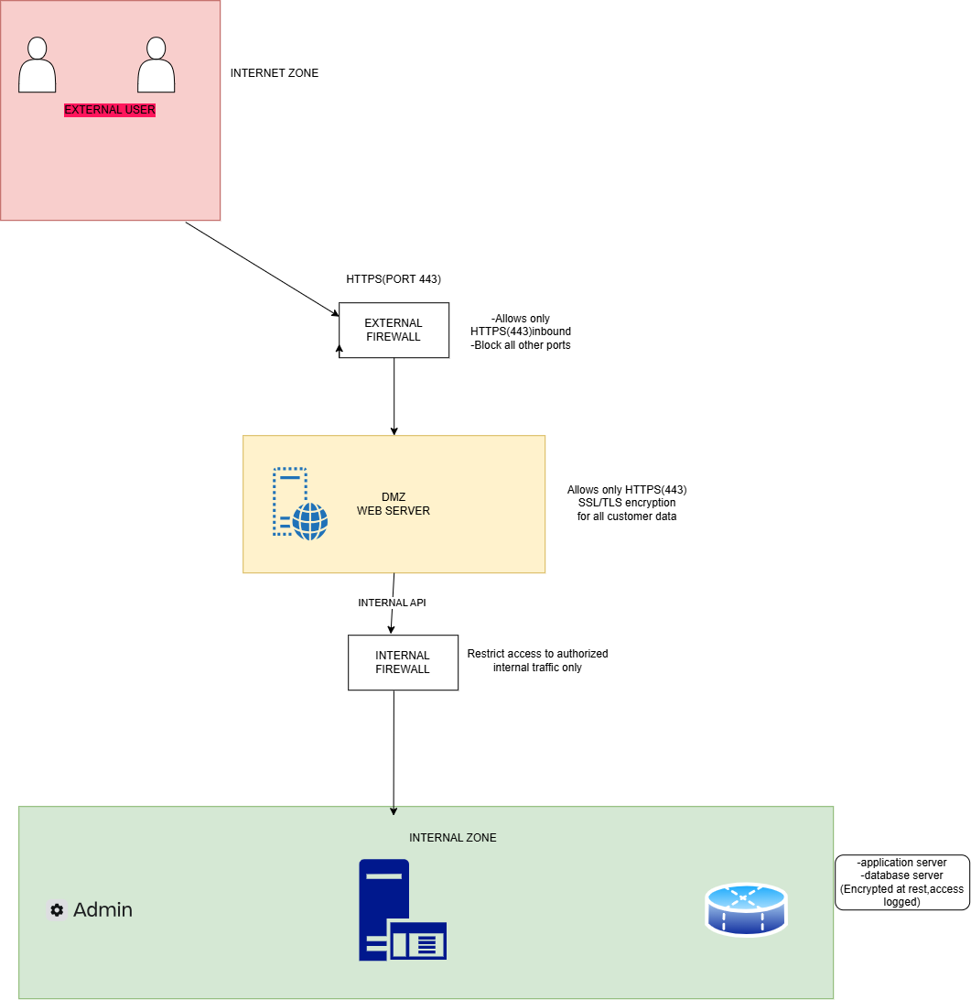

# Secure Web Application Network Architecture

A cybersecurity-focused network architecture designed to protect a public-facing web application while separating Internet-facing services from internal resources.

## Problem

A web application must be accessible to external users, but exposing internal systems directly to the Internet increases the potential attack surface.

The architecture therefore uses multiple security boundaries between external users, public-facing services, and internal resources.

## Architecture

The proposed architecture follows:

**External Users → External Firewall → DMZ Web Server → Internal Firewall → Internal Zone**

The public-facing web server is isolated in a DMZ, while an internal firewall provides an additional security boundary protecting internal resources.

## Components

- External Users
- External Firewall
- DMZ Web Server
- Internal Firewall
- Internal Zone
- Internal Administrative Systems

## My Contribution

I designed the network and security architecture, including the security zones, trust boundaries, traffic flow, and placement of the public-facing web server.

I focused on network segmentation and defense-in-depth principles to reduce the exposure of internal resources.

## Security Concepts Demonstrated

- Network segmentation
- DMZ architecture
- Defense in depth
- Perimeter security
- Internal security boundaries
- Controlled traffic flow
- Attack-surface reduction

## Threat Considerations

The architecture considers threats such as:

- Unauthorized Internet access
- Web application attacks
- Compromise of the public-facing server
- Lateral movement from a compromised DMZ host
- Unauthorized access to internal resources

## Future Improvements

A production implementation could include:

- Web Application Firewall (WAF)
- IDS/IPS
- TLS and certificate management
- Network Access Control
- Centralized logging
- SIEM integration
- Least-privilege firewall rules
- Vulnerability scanning
- High availability

## Project Status

Architecture/design project. A future implementation can reproduce this design in Cisco Packet Tracer or another network simulation environment.

## Author

**Muhammad Auwal Abdussamad**

Cybersecurity Student | Cloud Security & Network Security

GitHub: [@syngle20031](https://github.com/syngle20031)

LinkedIn: [Muhammad Auwal Abdussamad](https://www.linkedin.com/in/muhammad-abdussamad-5195853ab)
